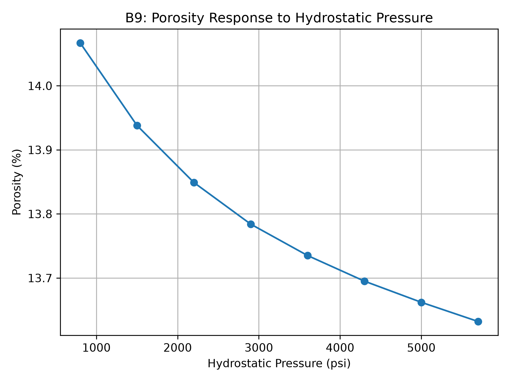
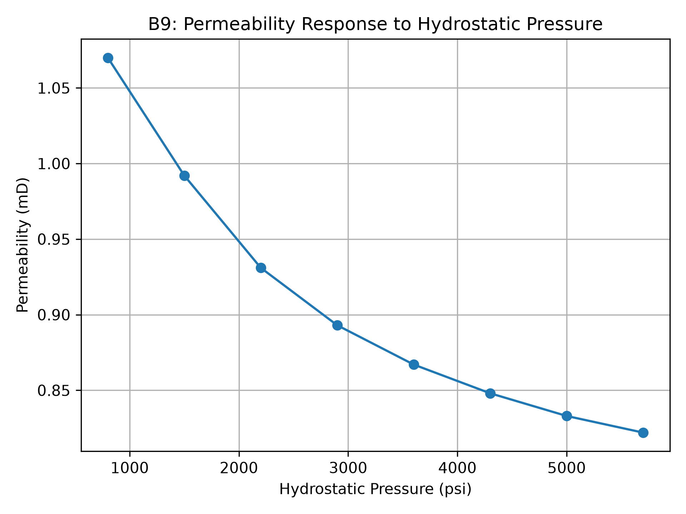
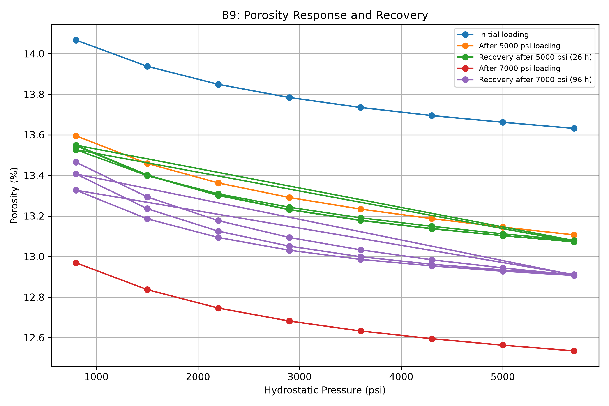
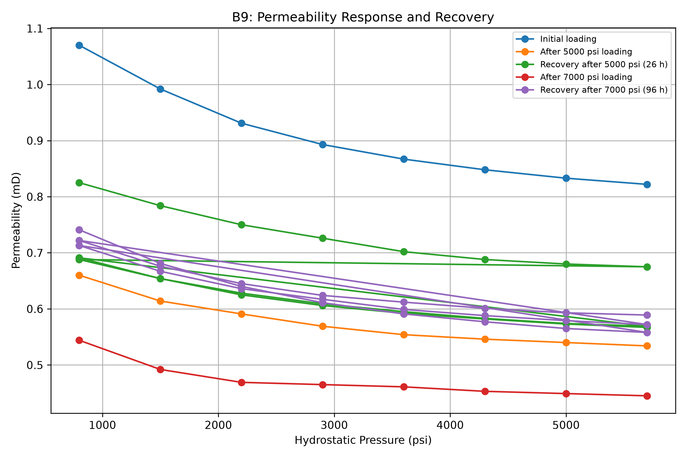
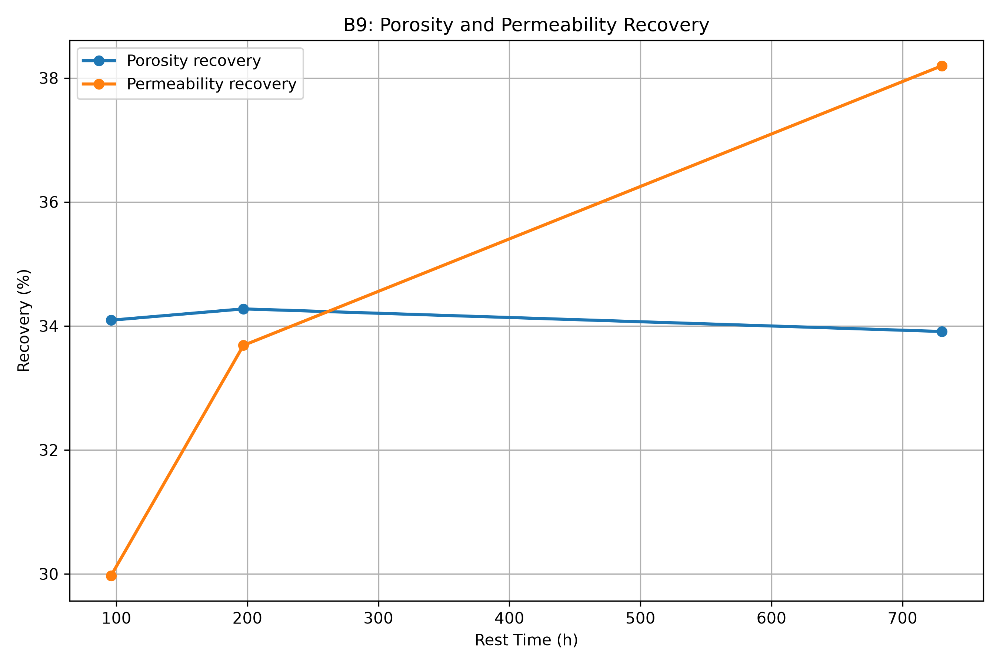
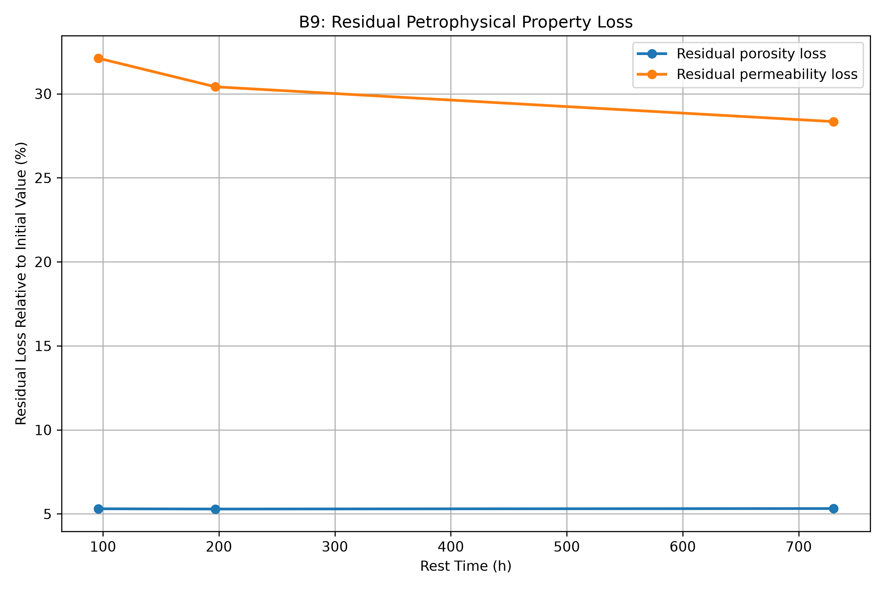

# Petrophysical Hysteresis and Pressure-Dependent Rock Properties

## Overview

This repository presents a **post-hoc computational analysis of experimental data generated during my MSc research in Petroleum Engineering**.

The original experimental study investigated the pressure-dependent and hysteretic behavior of petrophysical properties in carbonate reservoir rocks. This GitHub project extends that research by organizing the experimental data into a reproducible dataset and applying Python-based analysis to quantify pressure-related changes, recovery, and residual property loss.

The main computational analysis currently focuses on **sample B9** and examines the response of porosity and permeability to hydrostatic pressure loading, prolonged high-pressure exposure, and subsequent recovery periods.

> **Important:** The Python analysis presented here is a computational extension of the original experimental research. The original laboratory experiments were not performed using this Python workflow.

---

## Research Context

**MSc Petroleum Engineering — Drilling and Production**
Islamic Azad University, Science and Research Branch, Tehran
MSc thesis, Fall 1396 (2017)

The underlying research investigated residual and hysteretic changes in reservoir-rock petrophysical properties following pressure variations.

The experimental program involved carbonate reservoir-rock samples and examined the effects of hydrostatic pressure loading and subsequent relaxation/recovery on properties including:

* Porosity
* Permeability
* Pore volume
* Pore compressibility
* Acoustic properties
* Selected mechanical properties

The experimental work included measurements using a **CMS device**, together with CT imaging, SEM/EDAX characterization, acoustic measurements, and selected mechanical tests.

---

## Research Objective

The computational extension aims to quantify how pressure history affects reservoir-rock properties and to distinguish between:

1. Initial pressure-dependent changes
2. Property changes following prolonged high-pressure loading
3. Partial recovery during rest periods
4. Residual or irreversible property loss

A particular focus is placed on comparing **porosity and permeability responses**, since changes in these properties may not occur at the same magnitude or rate.

---

## Experimental Data

The current dataset contains measurements for carbonate sample **B9**.

The CMS measurements include pressure stages from:

**800 to 5700 psi**

The experimental sequence also includes prolonged exposure to elevated hydrostatic pressure followed by recovery/rest periods.

The current B9 dataset contains measurements associated with:

* Initial loading
* Prolonged 5000 psi loading
* Recovery after 5000 psi loading
* Prolonged 7000 psi loading
* Recovery after 7000 psi loading

The detailed dataset and provenance are documented in:

`data/README.md`

---

## Computational Workflow

The current Python workflow:

1. Loads the experimental dataset using Pandas
2. Filters the B9 sample
3. Groups measurements by experimental stage
4. Visualizes pressure-dependent porosity and permeability
5. Quantifies property reduction after prolonged pressure loading
6. Calculates recovery during rest periods
7. Calculates residual property loss
8. Compares porosity and permeability recovery
9. Calculates an experimental-data-based irreversibility index

### Main analysis script

`analysis/pressure_response.py`

---

## Key Quantitative Results — B9

The following results are calculated at **5700 psi**.

### Response after prolonged 7000 psi loading

| Property     |  Initial | After 7000 psi | Relative reduction |
| ------------ | -------: | -------------: | -----------------: |
| Porosity     |  13.632% |        12.535% |              8.05% |
| Permeability | 0.822 mD |       0.445 mD |             45.86% |

The results indicate a substantially larger relative change in permeability than in porosity for this sample and pressure history.

---

## Recovery Behavior

Recovery was evaluated after rest periods of 96, 197, and 730 hours.

### Porosity

| Rest period | Recovery | Residual loss |
| ----------: | -------: | ------------: |
|        96 h |   34.09% |         5.30% |
|       197 h |   34.28% |         5.29% |
|       730 h |   33.91% |         5.32% |

For B9, porosity recovery remained approximately stable over the investigated rest periods.

### Permeability

| Rest period | Recovery | Residual loss |
| ----------: | -------: | ------------: |
|        96 h |   29.97% |        32.12% |
|       197 h |   33.69% |        30.41% |
|       730 h |   38.20% |        28.35% |

Permeability recovery increased over the investigated rest period, while a substantial residual loss remained after 730 hours.

---

## Irreversibility Index

For this project, an **experimental-data-based irreversibility index** is used to quantify the fraction of the pressure-induced change that remains unrecovered after a specified rest period.

For the 730-hour recovery stage:

| Property     | Irreversibility Index |
| ------------ | --------------------: |
| Porosity     |                 5.32% |
| Permeability |                28.35% |

The index is defined here as:

$$
II =
\frac{Initial - Recovered}
{Initial - High\ Pressure}
\times 100
$$

where the values are evaluated at the same pressure condition.

A value of 0% represents complete recovery relative to the defined initial reference, whereas larger values indicate a larger unrecovered fraction.

This index is introduced specifically for the computational analysis in this repository and should not be interpreted as a universally standardized hysteresis metric.

---
## Figures

### Pressure response





### Hysteresis and pressure-history response





### Recovery analysis





## Interpretation

The current B9 analysis shows that the response of permeability to the investigated pressure history was substantially larger than the corresponding porosity response.

Following prolonged 7000 psi loading:

* Porosity decreased by 8.05%.
* Permeability decreased by 45.86%.

After 730 hours of recovery:

* Approximately 34% of the porosity reduction had recovered.
* Approximately 38% of the permeability reduction had recovered.
* Residual losses remained in both properties.

For this sample, the results therefore demonstrate that **petrophysical recovery is incomplete and property-specific**.

The analysis also suggests that monitoring porosity alone may not fully represent changes in flow-related properties such as permeability.

These observations are specific to the available B9 dataset and experimental pressure history and should not be generalized to all carbonate reservoir rocks without further data.

---

## Reproducibility

The analysis is designed to be reproducible from the CSV dataset.

### Requirements

* Python 3
* Pandas
* Matplotlib

### Run the analysis

From the project root:

```bash
python analysis/pressure_response.py
```

The script reads:

```text
data/experimental_data.csv
```

and generates figures in:

```text
figures/
```

---

## Repository Structure

```text
petrophysical-hysteresis-pressure-analysis/
│
├── README.md
│
├── data/
│   ├── README.md
│   └── experimental_data.csv
│
├── analysis/
│   └── pressure_response.py
│
├── figures/
│   ├── B9_porosity_pressure.png
│   ├── B9_permeability_pressure.png
│   ├── B9_porosity_hysteresis.png
│   ├── B9_permeability_hysteresis.png
│   ├── B9_recovery_comparison.png
│   └── B9_residual_loss_comparison.png
│
└── methodology/
    └── experimental_workflow.md
```

---

## Research Relevance

This project connects experimental petroleum-engineering research with computational analysis in areas including:

* Petrophysics
* Rock physics
* Rock mechanics and geomechanics
* Reservoir characterization
* Pressure-dependent rock properties
* Fluid–rock interaction
* Subsurface monitoring
* Geothermal reservoir behavior
* CO₂ storage and underground gas storage

The computational workflow also provides a foundation for extending the analysis to additional samples and experimental variables.

---

## Planned Extensions

Future development may include:

* Analysis of samples A2, A3, and B6
* Automated comparison of samples
* Pressure-normalized property changes
* Pore compressibility analysis
* Quantitative comparison of recovery kinetics
* Cross-property relationships between porosity and permeability
* Integration of additional experimental measurements
* Statistical analysis of sample-to-sample variability
* Improved visualization of pressure-history effects

---

## Data Provenance

The experimental data originate from my MSc research in Petroleum Engineering.

The laboratory measurements and experimental methodology belong to the original MSc research work. This repository reorganizes selected experimental data and applies a new computational analysis workflow for reproducibility, visualization, and further research development.

Detailed methodological information is provided in:

`methodology/experimental_workflow.md`

---

## Author

**Saeed Shaterian Bidgoli**

Petroleum Engineer | Reservoir Characterization | Rock Mechanics | Petrophysics | Subsurface Data Analytics

Research interests include pressure-dependent reservoir behavior, geomechanics, petrophysics, subsurface monitoring, geothermal energy, CO₂ storage, and computational analysis of subsurface data.
